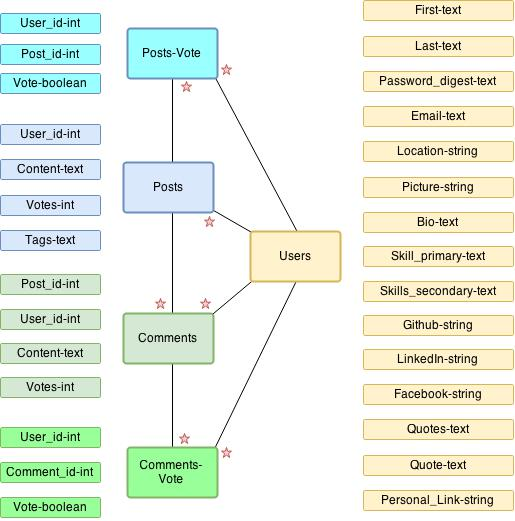

##Lemon Drops 

#### SPEC
1. Users should be able to log in.
2. Users should be able to view other users profile.
3. Users should see live updated forum.
4. Users should include all students, instructors and TAs.
5. Users should signed up in order to get pass validation.
6. Users should be able to search for other users.
7. Users should be able to add tags to their posts.
8. Users should be able to search for tags.
9. Users should be able to search through skill sets.

* Users should be able to post comments to each post.
* Users should be able to upvote posts and comments.
* Users should be able to meet up with other users in the area using 'meetup' button.

#### Profile
- Name
- Email
- Picture
- Github
- LinkedIn
- Facebook
- Location Button
- Skills
- Quotes
- Links to other projects / personal websites

#### Feed
- Posts with name/username with thumbnail, with link to profile
- Post contents
- Post tags
- Post comments
- Post upvote & scores
- Text area for new post
- Sort by button
- Comment button
- Click to show post contents
- Click to expand post comments

#### ERD

